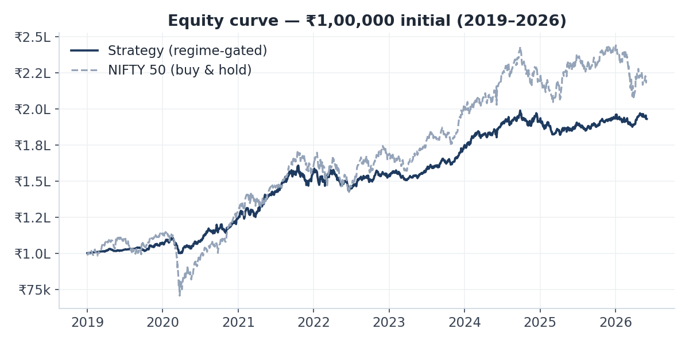
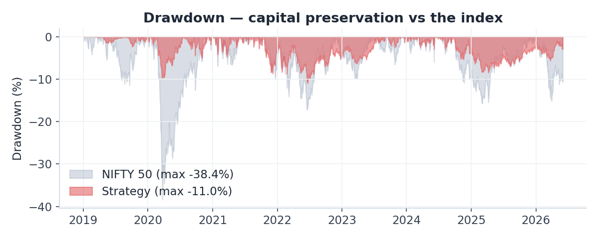
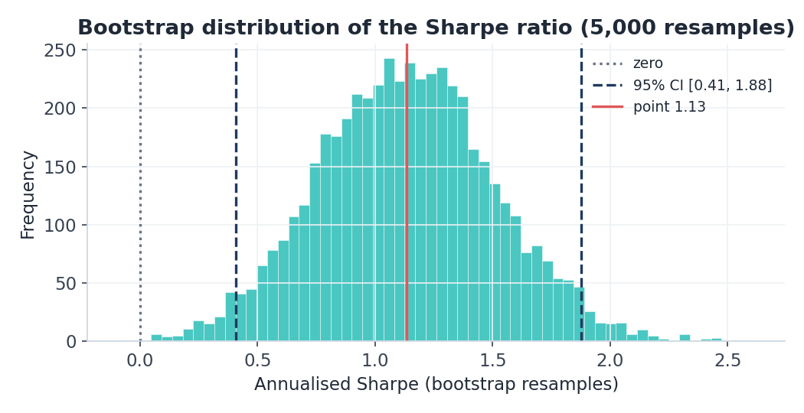
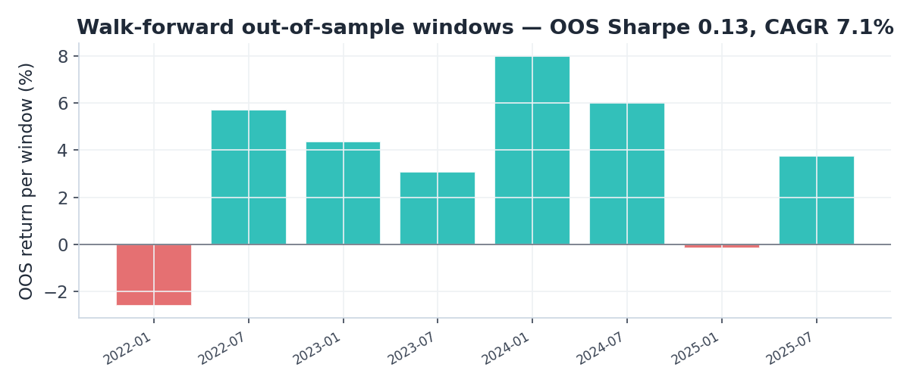
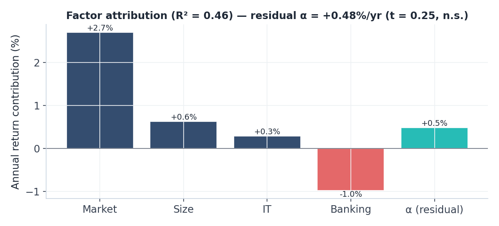

Live system: <https://ritwik-portfolio-advisor.streamlit.app> · Source code: <https://github.com/RitwikShetty05/portfolio-advisor>

---

## Abstract

This paper describes an end-to-end, auditable decision-support system for Indian
(NSE) equities. A Gaussian Hidden Markov Model labels each trading day's market
**regime** (bear / sideways / bull); four independent technical sub-engines —
trend, momentum, mean-reversion, and volume — vote to form a composite signal
that is then **gated by the prevailing regime**; and an event-driven backtester
simulates the resulting long-only portfolio with realistic capital, cost, and
stop-loss constraints. Over 2019–2026 (≈7.4 years, 1,832 daily observations on a
26-stock universe), the strategy returns a **9.3% CAGR at 8.3% volatility with a
−11.0% maximum drawdown**, versus the NIFTY 50's 11.1% CAGR at 17.5% volatility
and a −38.4% drawdown. Its risk-adjusted return (Sharpe 0.37 over the risk-free
rate) modestly exceeds buy-and-hold while cutting drawdown roughly **three-fold**.
Crucially, the paper does not stop at a point estimate: a bootstrap confidence
interval, the Probabilistic and **Deflated Sharpe Ratios**, Newey–West HAC alpha
t-statistics, a four-factor attribution, and an anchored **walk-forward
out-of-sample** test are all reported. These tools tell an honest story — the
strategy's raw Sharpe is robustly positive, but its *excess-over-cash* and
*factor-adjusted* alphas are **not statistically significant**. The system's edge
is regime-based **risk management**, not security selection — and the paper's
central contribution is the validation framework that establishes this distinction.

---

## 1. Problem statement

Most retail and student "trading systems" fail the same two tests. First, they
are **regime-blind**: an RSI of 35 is treated identically in a roaring bull market
(a buy-the-dip opportunity) and a collapsing bear market (a value trap). Second,
they are validated with a **vectorised, look-ahead backtest** — *Signal × forward
return* — that silently assumes infinite capital, no transaction costs, no
position limits, and stop-losses that never fire intraday. The result is a
headline Sharpe of 3–4 that evaporates in live trading.

This project targets both failures directly. It (a) makes regime an explicit,
first-class input that gates every decision, and (b) subjects the strategy to an
event-driven simulation and a battery of statistical-significance tests designed
specifically to detect overfitting and luck. The goal is **not** to claim a
market-beating edge; it is to build a transparent, auditable system and then to
characterise its performance *honestly*.

---

## 2. System architecture

The pipeline is a sequence of pure, independently testable stages. Indicators
("facts about the data") are deliberately separated from signals ("decisions"),
so the signal logic can be rewritten without touching the math and any indicator
can be inspected in isolation.

```
        yfinance (NSE + NIFTY 50)
                  │
          data_loader.py        QA gate, corporate-action adjust, CSV cache
                  │
           features.py          32 indicators across 6 groups
                  │
            regime.py           Gaussian HMM → BEAR / SIDEWAYS / BULL
                  │
            signals.py          4 sub-engines → composite → regime-gated B/S/H
                  │
     ┌────────────┼─────────────────────────┐
 backtest.py   portfolio.py             recommend.py
 event-driven  Markowitz risk           ranked Buy + Exit
     │            │                          │
     └────────────┴─────────────────────────┘
                  │
   significance.py · walkforward.py · factor_attribution.py   (validation)
                  │
              app.py            5-page Streamlit dashboard
```

The universe is 26 large- and mid-cap NSE stocks spanning eight sectors (IT,
Banking, Energy, FMCG, Auto, Pharma, Metals, Telecom); the benchmark is the NIFTY
50 (`^NSEI`). All statistics use the India 10-year G-sec (6.5%) as the risk-free
rate and 252 trading days for annualisation.

---

## 3. Methodology

### 3.1 HMM regime detection

Regimes are detected with a three-state **Gaussian Hidden Markov Model**
(`hmmlearn`, full covariance, 200 EM iterations) fit on three standardised
features per day: the 5-day return, 20-day realised volatility, and Bollinger
Band width. The Viterbi path gives the hard regime label; the forward–backward
pass gives a continuous posterior `P(bull)` used as a *soft* gate (below). Hidden
states are mapped to BEAR / SIDEWAYS / BULL by their mean 5-day return, so the
labelling is economically meaningful rather than arbitrary.

The HMM is preferred over a moving-average rule or K-means because it models
regime **persistence** through the transition matrix. On the NIFTY 50 the fitted
matrix gives **P(bull → bull) = 0.97** — regimes are sticky, so a single green or
red day does not flip the label, which is exactly the behaviour a discretionary
PM exhibits and a per-day classifier does not. (In-house validation on synthetic
data with an embedded crash recovered ≈90% of true bear days with the HMM versus
≈38% for a moving-average rule.) Over the sample the index spent roughly **36% of
days in bear, 37% in sideways, and 27% in bull** regimes — a useful reminder that
"the market goes up" describes only about a quarter of trading days.

> *Reference: Rabiner (1989), "A Tutorial on Hidden Markov Models."*

### 3.2 Four-engine signal voting

Rather than one monolithic rule, four sub-engines each cast a vote in $[-1,+1]$
and are combined by a fixed weighting:

| Sub-engine | Weight | Reads |
|---|---|---|
| Trend | 0.30 | MA 20/50/200 structure, MACD histogram |
| Momentum | 0.30 | RSI, MACD line + slope, ROC |
| Mean-reversion | 0.20 | Bollinger %B, Stochastic |
| Volume confirmation | 0.20 | OBV slope, volume ratio |

The weighted sum is the composite score, `Score_Raw` $\in[-1,+1]$. Real desks
*triangulate* — a buy backed by trending price, healthy momentum, **and**
confirming volume survives noise better than any single indicator — and weighting
the lenses (rather than AND-ing rigid rules) degrades gracefully when one
disagrees.

The composite is then **gated by regime**. Because `Score_Raw` is an *average* of
four bounded votes that rarely align perfectly, its empirical range is itself
bounded (95th percentile ≈ 0.48, observed maximum ≈ 0.66). The gates are therefore
calibrated to that achievable range, while preserving the core philosophy — harder
to buy and easier to sell as the tape deteriorates:

| Regime | Buy if score ≥ | Sell if score ≤ | Size multiplier |
|---|---|---|---|
| Bull | 0.30 | −0.50 | 1.0 |
| Sideways | 0.40 | −0.40 | 0.7 |
| Bear | 0.50 | −0.25 | 0.5 |

When the HMM posterior is available, the thresholds are additionally tilted up to
±0.10 by `P(bull)`, so participation ramps *smoothly* as a bear regime softens
rather than waiting for a discrete flip. Each buy is annotated with an
ATR-based stop (entry − 2 × ATR) and two targets (+2 × / +4 × ATR), the
Turtle-Trader convention that scales risk with each stock's own volatility.

### 3.3 Event-driven backtest

The backtester walks the trading calendar day by day. Each day it (1) accrues
one day of risk-free interest on idle cash, (2) marks open positions to market,
(3) fires stop-losses **intraday at the stop level** (the conservative worst-case
fill), (4) closes positions on sell signals at the close, and (5) deploys capital
into the highest-confidence new buys subject to an 8-position cap, a 10%-of-NAV
per-position cap, and a 0.1% round-trip transaction cost. Position size targets
the per-stock cap, scaled down by the regime risk multiplier and a mild conviction
tilt; the best ideas are funded first when cash or slots bind.

Two modelling choices deserve emphasis because they materially (and *honestly*)
affect the results:

- **Idle cash earns the risk-free rate.** A regime-aware strategy's defining
  feature is stepping aside into cash during weak tapes; modelling that cash at
  0% would penalise the strategy for its core behaviour. A real book parks cash
  in liquid funds at ≈the risk-free rate, so we accrue it. This is a realism
  correction, internally consistent with the rate used in the Sharpe denominator
  — not a tuning knob.
- **Stops fill at the stop, not the close.** Most amateur backtests assume the
  optimistic close-price fill; we assume the pessimistic one.

---

## 4. Results



Over 2019–2026 the strategy grows ₹1,00,000 to **₹1,93,044** (a 93.0% total
return, **9.3% CAGR**) at **8.3% annualised volatility**. The headline figures,
with the NIFTY 50 buy-and-hold over the identical window for context:

| Metric | Strategy | NIFTY 50 (buy & hold) |
|---|---:|---:|
| CAGR | 9.27% | 11.08% |
| Annualised volatility | 8.28% | 17.54% |
| **Sharpe (excess of 6.5% RF)** | **0.37** | ~0.26 |
| Sortino / Calmar | 0.50 / 0.84 | — |
| **Maximum drawdown** | **−10.98%** | **−38.4%** |
| Beta to NIFTY | 0.29 | 1.00 |
| Jensen's α (CAPM, annualised) | +1.35% | — |

The strategy earns a **lower absolute return but a higher risk-adjusted return**
than simply holding the index, while cutting the worst peak-to-trough loss by
roughly three-fold. The drawdown chart makes the trade-off vivid: during the March
2020 COVID crash the NIFTY fell 38%, while the strategy — having de-risked into
cash as the HMM flagged a bear regime — drew down only ~11%.



At the trade level the system took **140 trades** with a 32.9% win rate but a
**profit factor of 2.25** (average win ₹2,310 vs average loss −₹503) and a
positive ₹421 expectancy per trade — a classic trend-following signature of many
small losses paid for by fewer large wins.

---

## 5. Statistical validation

A tearsheet reports point estimates; this section asks whether they are
*distinguishable from luck*. All tests use the 1,832 daily strategy returns.

### 5.1 Bootstrap confidence interval on the Sharpe ratio

Resampling the daily-return series with replacement 5,000 times and recomputing
the annualised Sharpe each time yields the sampling distribution below. The 95%
percentile interval on the **raw** Sharpe (tested against zero) is **[0.41, 1.88]**
around a point estimate of **1.13** — comfortably excluding zero.



### 5.2 Probabilistic and Deflated Sharpe Ratios

The PSR gives the probability that the true Sharpe exceeds a benchmark, adjusted
for the return distribution's skew (−0.32) and excess kurtosis (+1.87). Against a
zero benchmark, **PSR = 99.9%**. The **Deflated Sharpe Ratio** then corrects for
*selection bias* — deflating the benchmark to the expected maximum Sharpe of
$N$ trials under the null (here $N=10$, $E[\max SR_0] = 0.58$). The raw Sharpe
survives this honestly: **DSR = 92.8%**.

**The honest caveat.** Because idle cash now earns the risk-free rate, the *raw*
Sharpe partly reflects that risk-free baseline. The fair test of skill *above
cash* uses excess-over-RF returns — and there the picture is appropriately
humbler: Sharpe **0.37**, 95% bootstrap CI **[−0.35, 1.10]** (which **includes
zero**), PSR 84%, DSR 29%. In other words, the strategy is very likely better than
holding nothing, but **not** demonstrably better than simply earning the
risk-free rate.

### 5.3 Newey–West HAC alpha t-statistic

Regressing strategy excess returns on NIFTY excess returns (CAPM) gives a beta of
0.29 and a Jensen's alpha of **+1.35%/yr**. Using **Newey–West HAC** standard
errors (7 lags) to correct for the serial autocorrelation in daily residuals, the
alpha carries a t-statistic of **0.62** (p = 0.54) — **not** statistically
significant. The positive alpha is real as a point estimate but cannot be
distinguished from noise at conventional thresholds.

> *References: Bailey & López de Prado (2012, 2014); Newey & West (1987).*

### 5.4 Walk-forward out-of-sample test

The single most important guard against overfitting: an **anchored walk-forward**.
The HMM is re-fit on a growing training window (starting at 3 years); regimes and
signals are generated on a held-out 6-month test window using *only* the
train-fit model; and the eight non-overlapping test windows (≈4 years, 2022–2026)
are chained into one out-of-sample equity curve.



The out-of-sample result is **positive but degraded** relative to in-sample — which
is exactly what an honest walk-forward should show: **OOS Sharpe 0.13, CAGR 7.08%,
maximum drawdown −5.6%**, with 6 of 8 windows positive. The OOS CAGR (7.1%) edges
the 6.5% risk-free rate; the strategy generalises, but its margin is thin.

---

## 6. Factor attribution

A CAPM regression only asks whether the strategy beat *the market*. But size,
sector, and other systematic tilts are passively earnable — so a final
multivariate regression decomposes returns onto four Indian-market factor proxies:
the market (`^NSEI`), a size spread (`^NSEMDCP50 − ^NSEI`, SMB-style), and IT and
Banking sector tilts (`^CNXIT`, `^NSEBANK`), all with HAC standard errors.



| Factor | Loading (β) | t-stat | Annual contribution |
|---|---:|---:|---:|
| Market | +0.448 | 6.51 | +2.70% |
| Size (SMB-style) | +0.083 | 5.15 | +0.63% |
| IT tilt | +0.044 | 3.27 | +0.29% |
| Banking tilt | −0.164 | −6.29 | −0.98% |
| **Residual α** | — | **0.25** | **+0.48%** |

The factors explain **R² = 0.46** of the return variation. Every factor loading is
strongly significant — the strategy carries a modest long-market, small
size-and-IT tilt and a short-Banking tilt — but the **residual alpha of +0.48%/yr
is not significant (t = 0.25)**. This is the paper's most important and most
honest finding: once known, passively-earnable exposures are accounted for, there
is **no statistically significant security-selection skill**. The system's value
is concentrated in *when* it is in the market (regime-based risk management and
drawdown control), not in *which* stocks it picks.

---

## 7. Limitations and future work

The evaluation is deliberately candid about what it cannot claim:

- **No significant excess-of-cash or factor-adjusted alpha.** The defensible
  claim is risk reduction (≈⅓ the index's drawdown at a comparable Sharpe), not
  outperformance through stock selection.
- **A single universe and regime, in-sample for factor construction.** 26 stocks
  over one 7-year window that is itself a historically strong bull market for
  Indian equities; the factor proxies are correlated and not orthogonalised the
  way canonical Fama–French factors are.
- **Survivorship and point-in-time gaps.** The universe is today's large-caps;
  corporate actions (e.g. the Tata Motors demerger) leave data discontinuities.
- **No slippage or market-impact model** beyond a flat 0.1% cost, and **long-only**
  with no shorting or derivatives.
- **Walk-forward without purge/embargo.** The next rigour increment is to add a
  purge-and-embargo gap between train and test to remove any leakage through
  overlapping indicator windows.

Natural extensions: a sentiment sub-engine (news/RSS tone), risk-profile presets
that adjust the gates and sizing, a depth-aware slippage model, Monte-Carlo stress
testing, and a longer multi-cycle / multi-market evaluation.

---

## 8. References

1. Rabiner, L. R. (1989). *A Tutorial on Hidden Markov Models and Selected
   Applications in Speech Recognition.* Proceedings of the IEEE, 77(2).
2. Bailey, D. H., & López de Prado, M. M. (2012). *The Sharpe Ratio Efficient
   Frontier.* Journal of Risk, 15(2).
3. Bailey, D. H., & López de Prado, M. M. (2014). *The Deflated Sharpe Ratio:
   Correcting for Selection Bias, Backtest Overfitting, and Non-Normality.*
   Journal of Portfolio Management, 40(5).
4. Newey, W. K., & West, K. D. (1987). *A Simple, Positive Semi-Definite,
   Heteroskedasticity and Autocorrelation Consistent Covariance Matrix.*
   Econometrica, 55(3).
5. Fama, E. F., & French, K. R. (1993). *Common Risk Factors in the Returns on
   Stocks and Bonds.* Journal of Financial Economics, 33(1).

---

*Disclaimer: This system is a decision-support and research tool, not investment
advice. Backtested performance does not guarantee future results. Built by Ritwik
Shetty as an end-to-end demonstration of quant tooling: data engineering → machine
learning → statistical risk management → production frontend.*
